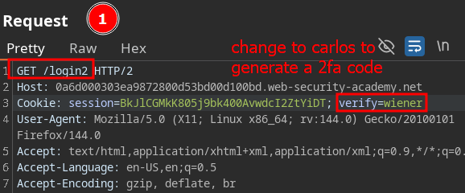
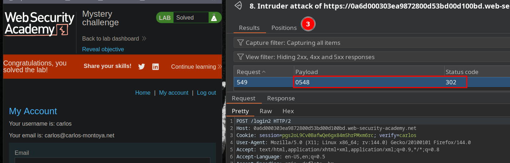

# 2FA broken logic (brute-force 2fa code)

In this lab, we encounter the following workflow when logging in:

- 1: post /login
- 2: get /login2 (generates 2FA code)
- 3: post /login2 (enters 2FA code)
- 4: get /my-account

Our objective will be:

- 1: log in to our account
- 2: intercept login2 and add **carlos** to verify to **generate a 2fa code in carlos' email**
- 3: in post /login 2 **brute force** the 2fa code

