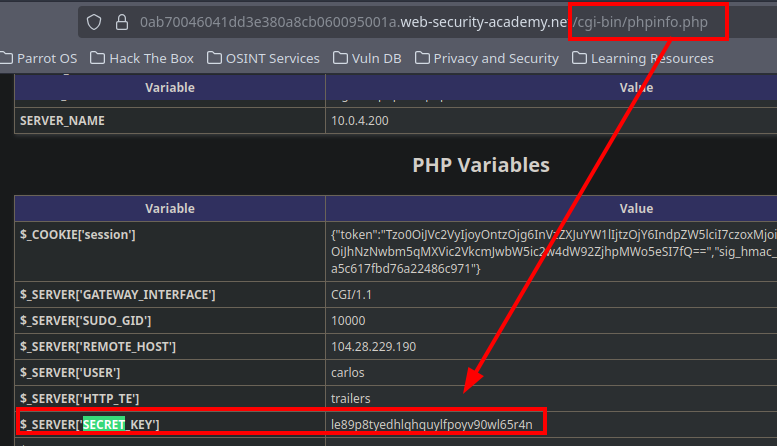
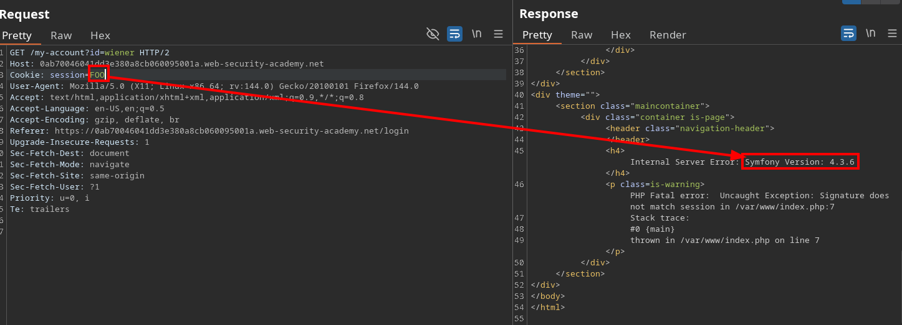
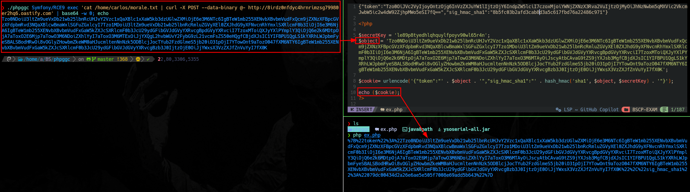

# PHP deserialization with a pre-built gadget chain using phpgcc

In this lab, we are presented with a PHP‑serialized cookie.
Our objective is to create a new cookie containing a malicious serialized object using the phpggc tool.

```
{"token":"Tzo0OiJVc2VyIjoyOntzOjg6InVzZXJuYW1lIjtzOjY6IndpZW5lciI7czoxMjoiYWNjZXNzX3Rva2VuIjtzOjMyOiJhNzNwbm5qMXVic2VkcmJwbW5ic2w4dW92ZjhpMWo5eSI7fQ==","sig_hmac_sha1":"8b5fc03b2afd3cab8d3a5c617fbd76a22486c971"}

O:4:"User":2:{s:8:"username";s:6:"wiener";s:12:"access_token";s:32:"a73pnnj1ubsedrbpmnbsl8uovf8i1j9y";}
```

The cookie is protected using HMAC‑SHA1.

We discover the server’s secret key and the framework in use:





Next, we generate the malicious serialized object, providing the framework and the system command we want to execute as arguments.

We then build a new cookie containing the malicious object together with a valid access token, signed using the secret key.



We finally use this serialized object inside the cookie, which gets deserialized by the application and triggers our injected code execution.