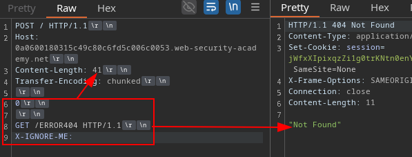
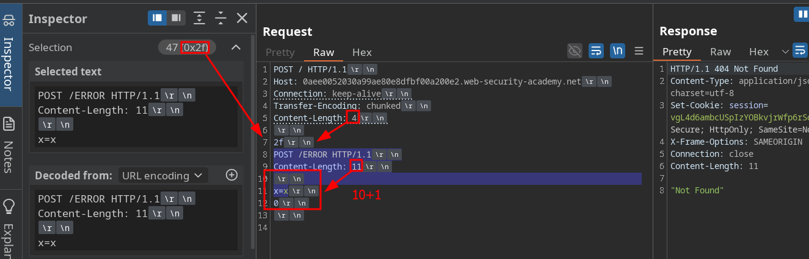

# HTTP REQUEST SMUGGLING- CHEATSHEET + MOST IMPORTANT LABS

## Index

- [DETECT CL-TE](#detect-cl-te)
- [DETECT TE-CL](#detect-te-cl)
- [MOST IMPORTANT LABS](#walkthrough---most-important-labs)

## Key Terms

```
- Content Length    -> size in decimal
- Transfer Encoding -> size in hexadecimal
- HTTP 2 -> CL inferred from data frames
- CRLF (Carriage Return Line Feed) Injection 
- Response queue poisoning
```

## Walkthrough - Most Important Labs


- [CL.TE to obtain custom header via SSRF](CL.TL-to-reveal-custom-heaeder-via-ssrf.md)
- [CL.TE to steal cookie via post comment](CL-TL-to-steal-cookie.md)
- [CL.TE + XSS in UserAgent to steal cookie](CL-TL-XSS-steal-cookie.md)

- [H2.TE response queue poisoning](H2.T2.queue.md)
- [HTTP/2 - CRLF injection + EXTRA](HTTP2-CRLF.md)

## Methodology

```bash
- 1 -> downgrade to HTTP/1.1 -> switch to POST && remove headers -> disable CL auto-refresh -> show non-printable characters
- 2 -> Http Request Smuggler -> HTTP1 / HTTP2
- 3 -> Detect vulnerability type
```

#### DETECT CL-TE





#### DETECT TE-CL

