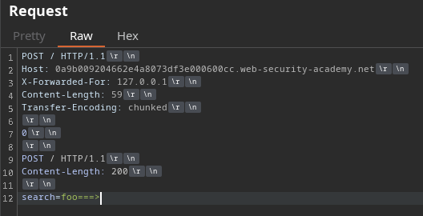
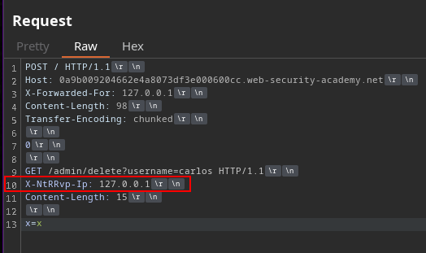

# CL.TL to reveal custom header

The administrator panel at /admin is only accessible for requests coming from the IP 127.0.0.This must be specified through a custom header that we currently do not know.

We dump the request contents in the search section, where we find the custom header that we will later use.

