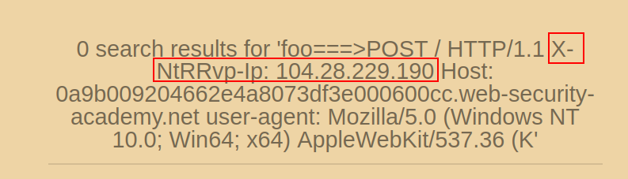

# CL.TL - HTTP request smuggling to reveal custom header front-end request rewriting via SSRF

The administrator panel at /admin is only accessible for requests from IP address 127.0.0.1. This must be specified using a custom header that we do not know.

We dump the content of the request in the search section, where we find the custom header that we will use later. 

