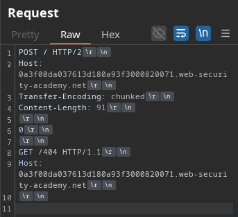
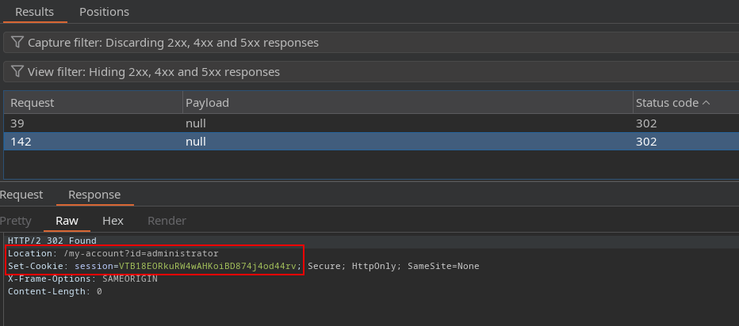

# H2.TE response queue poisoning

We sent the request to the Burp Intruder.

- null payload -> continue indefinitely
- resource pool -> maximum concurrent 1 -> delay between requests 800
- settings -> disable CL update
- filter -> 3xx

