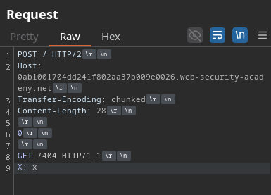
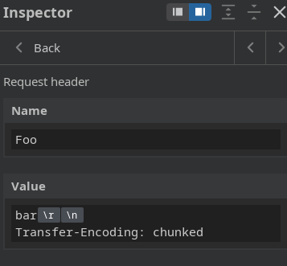
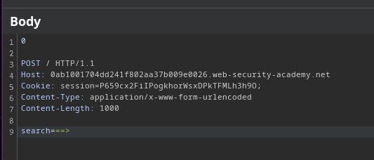
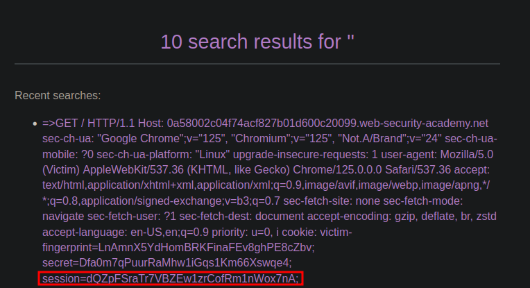
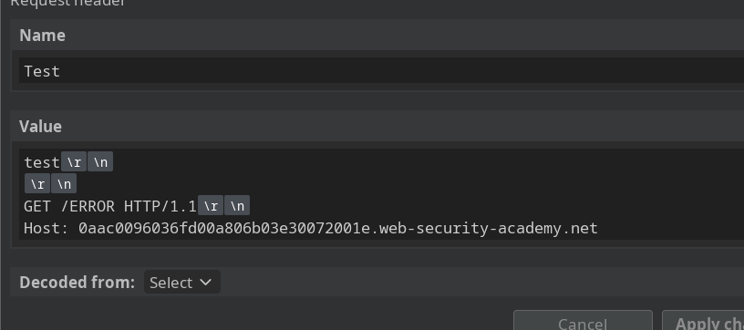

# HTTP/2 - CRLF injection 

In this lab, the application sanitizes the Transfer-Encoding header in some way.

To bypass this restriction, we inject one value inside another value using \r\n (this is known as CRLF injection):

Once we have verified the HTTP request smuggler by viewing the 404 code, we dump the victim's response into the search history.

## EXTRA

You can also inject an entire request through the value of a header.

