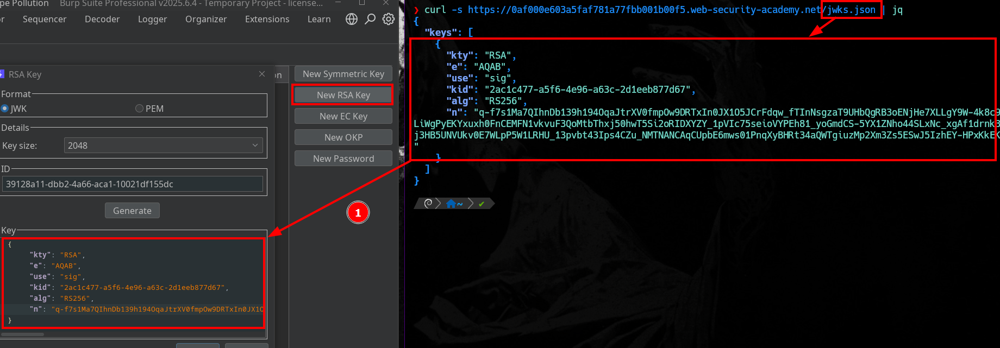
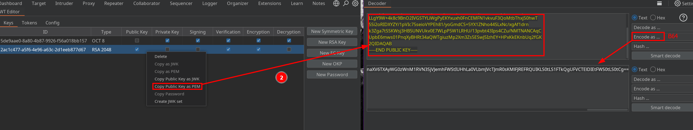
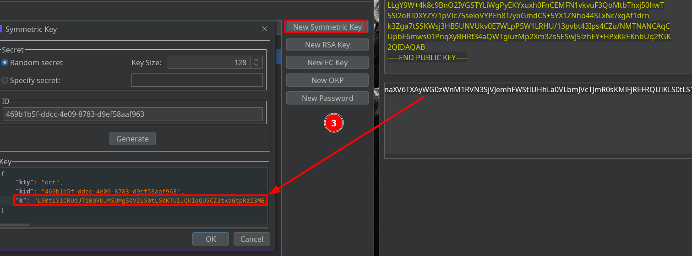
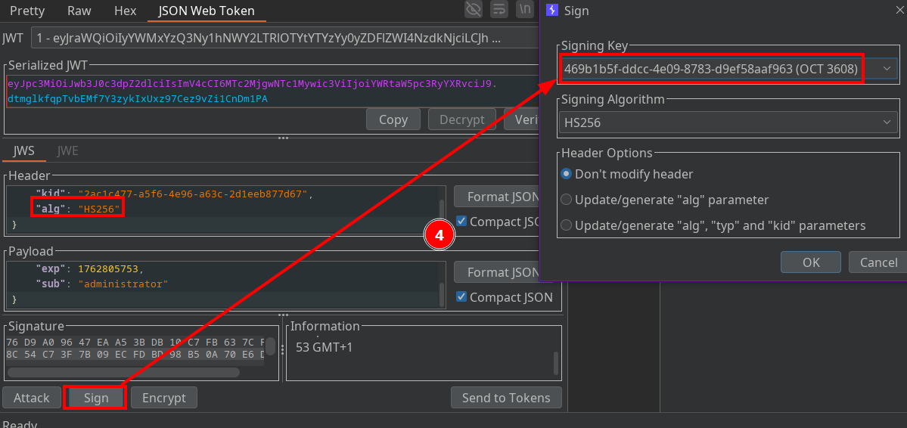

# JWT authentication bypass via algorithm confusion (public key exposed)

In this lab we found a server vulnerable to **algorithm confusion**: it **exposes** its public key at **/jwks.json** and is misconfigured so that the same public key can be abused for both RS256 (asymmetric) and HS256 (symmetric).

When a server uses the public key value as if it were an HMAC secret, an attacker can craft valid HS256 tokens without needing the server’s private key.

1) Generate an RSA key (using the exposed public values)

Create an RSA keypair based on the public key that the server exposes 

2) Build a symmetric key from the RSA public key

Convert the RSA public key (PEM) to Base64 and use that Base64 string as your HMAC secret. In other words, reuse the server’s public key bytes as the symmetric key value.

3) Switch the token algorithm to HS256 and sign with the derived secret

Modify the JWT header from alg: "RS256" to alg: "HS256", then sign the token using the symmetric key built from the server’s public key. If the server incorrectly accepts HS256 and uses the public key as the HMAC secret, your forged token will validate.

