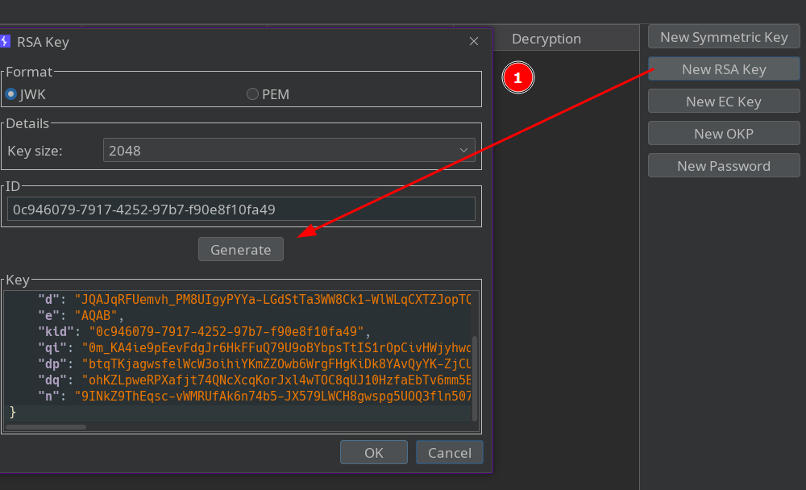
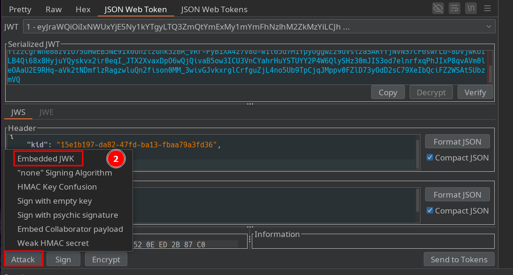

# JWT authentication bypass via jwk header injection

By abusing the jwk parameter in the token header, a vulnerable server may accept a JWT that embeds the public key used to verify its signature — without checking whether that key comes from a trusted source.

- 1: Generate our RSA key pair (private + public).

- 2: Inject our public key into the JWT header using jwk.

- 3: Sign the JWT with our private key and send it to the server.

If the server is vulnerable and uses the jwk supplied by the client to verify the signature, verification will succeed and the token will be accepted.