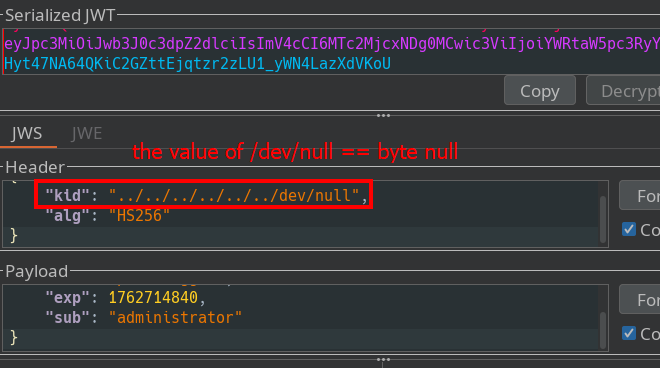

# JWT authentication bypass via kid header path traversal

In this exercise we encounter an insecure JWT implementation where the server uses the kid header value to read, from the filesystem, the key used to validate the token signature. We exploit this by injecting a path‑traversal sequence into kid that points to the file /dev/null, which contains predictable content.

Assume the backend is implemented roughly like this:

```python
with open("keys/" + header["kid"]) as f:
    key = f.read()
```

- keys directory exists

- It reads the kid value from the header


1: We create a symmetric key and sign with a null byte.


2: We apply path traversal to the kid value, setting it to the null‑byte content coming from /dev/null.


