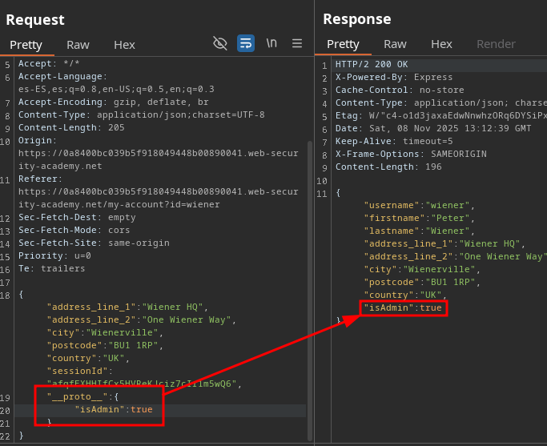
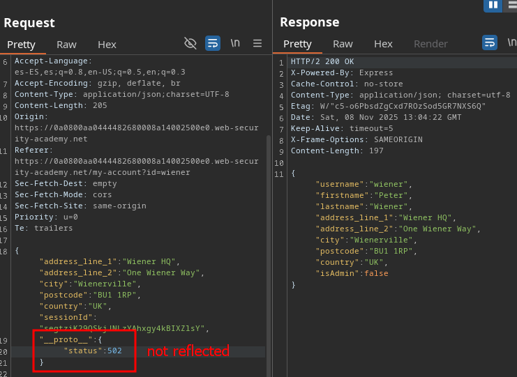
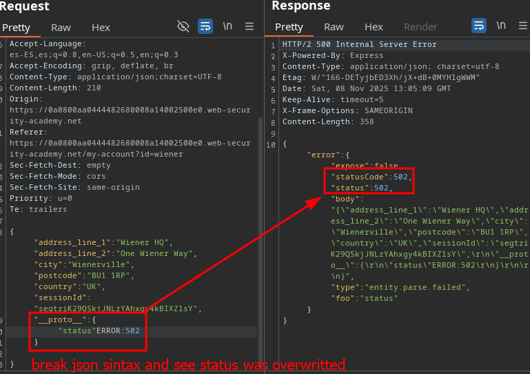

# Detection Server Side Prototype Pollution

You can also use the Server-Side Prototype Pollution Scan extension.

Detecting server-side prototype pollution without polluted property reflection:

