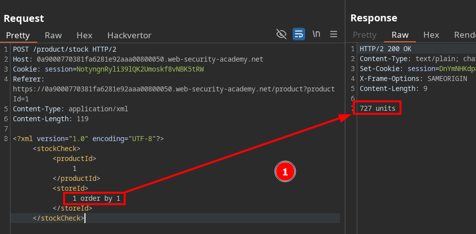
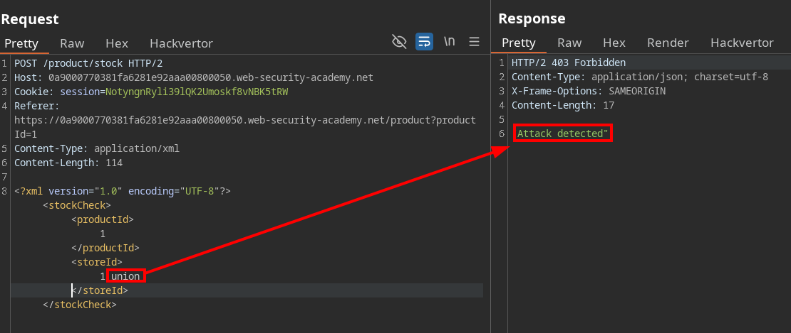
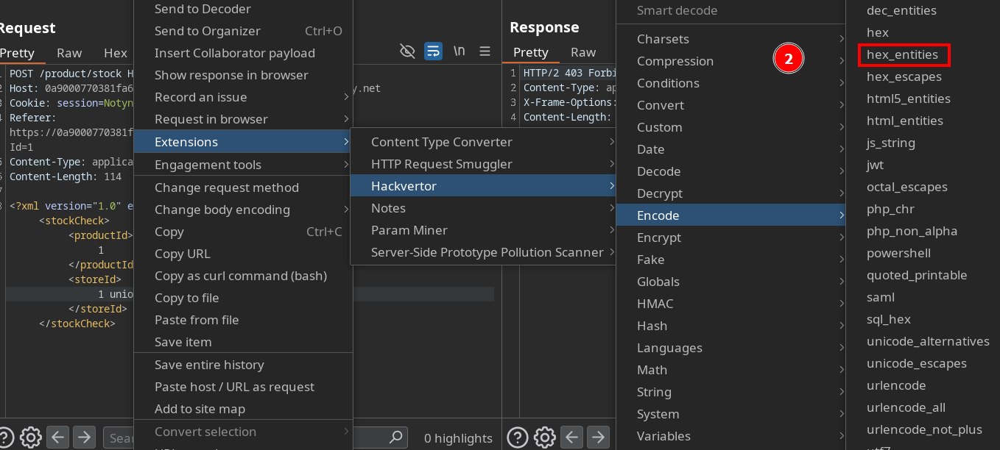
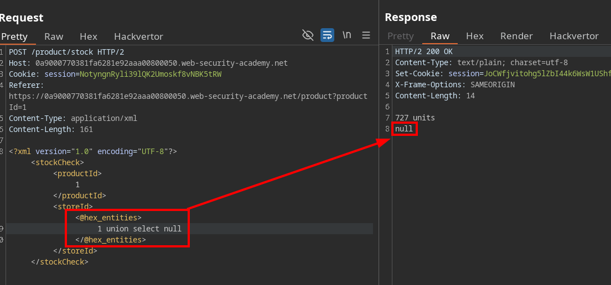

# SQL injection with filter WAF bypass via XML encoding with Hackvertor extension

In this lab we identified an SQL injection occurring within XXE entities

We discovered that certain keywords were blacklisted by the WAF

Using the BurpSuite extension HackVertor, we managed to bypass this restriction

We confirmed that the WAF bypass was successful

Finally, we were able to retrieve the required data

