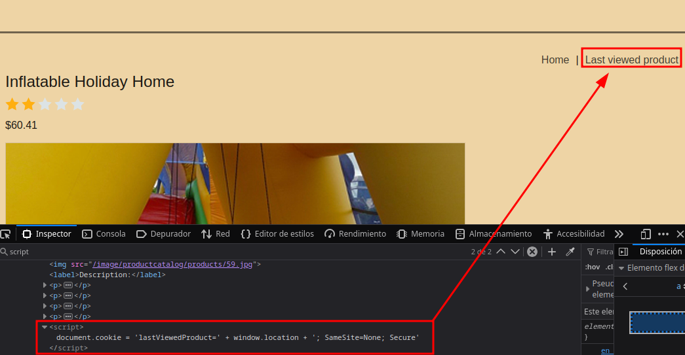
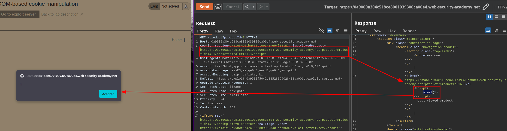
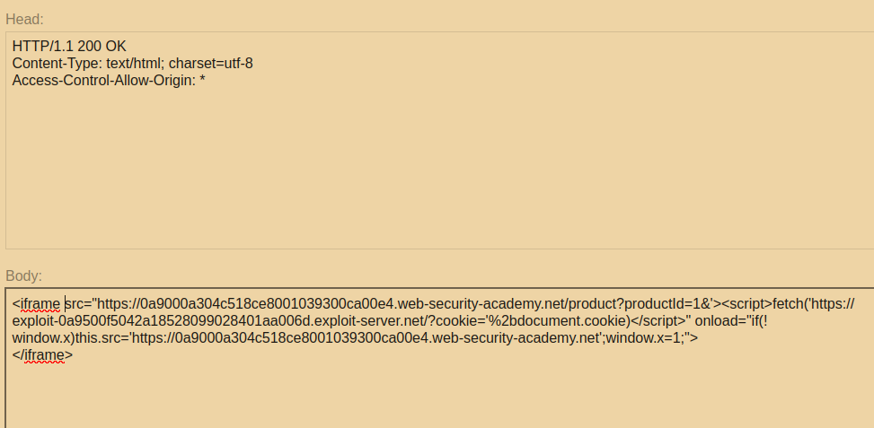
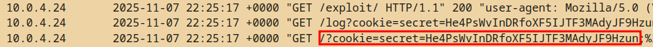

# DOM-based cookie manipulation (last viewed product)

We found that a cookie value is being set via the last viewed product feature, which assigns the URL as its value.

We escape the href anchor tag and inject our payload.

We create a script to exfiltrate the cookie.

> if(!window.x) is the logic used to prevent an infinite loop.